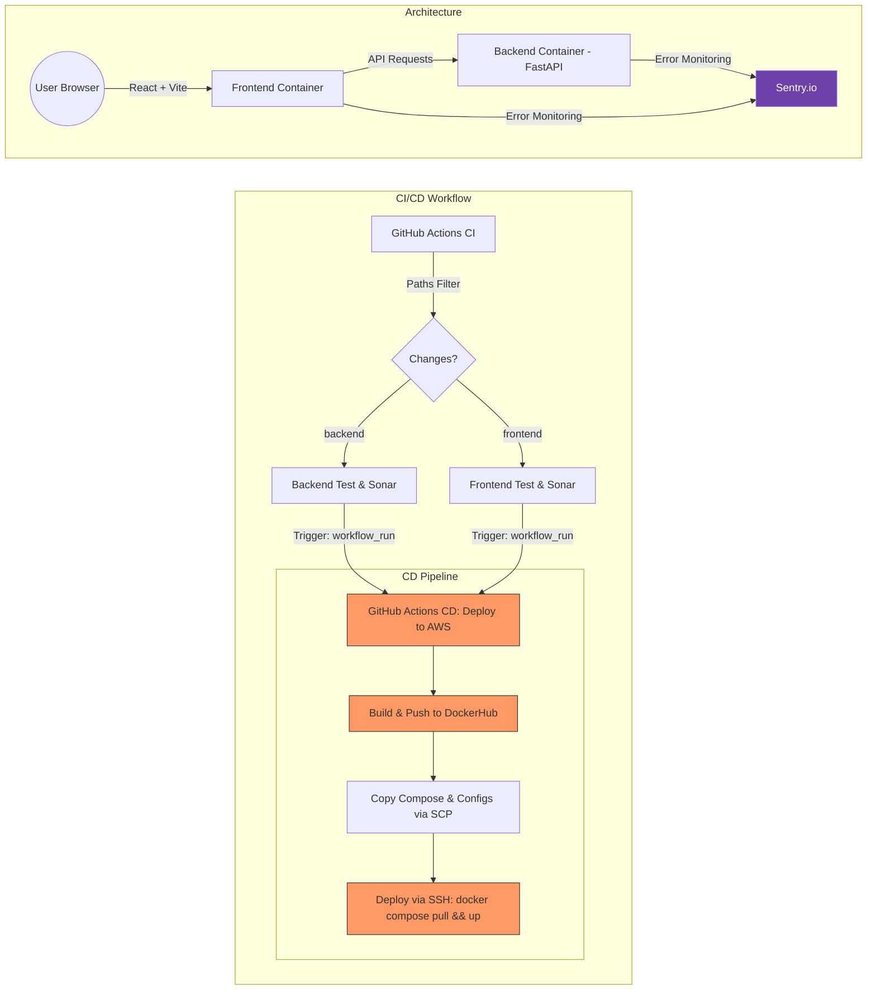

# 🚀 DevOps Playground: Fullstack CI/CD Case Study


[](https://sonarcloud.io/summary/new_code?id=Zhuravka-AI_devops-playground)
[](https://sonarcloud.io/summary/new_code?id=Zhuravka-AI_devops-playground)


This project is a live demonstration of a modern **Software Development Life Cycle (SDLC)**. It features a Monorepo architecture with a FastAPI backend and React frontend, governed by a rigorous CI/CD pipeline.

---

## 🚀 Live Access

* **🌐 Main Application:** [http://ec2-51-21-45-71.eu-north-1.compute.amazonaws.com/](http://ec2-51-21-45-71.eu-north-1.compute.amazonaws.com/)
* **🌐 API Documentation:** [http://ec2-51-21-45-71.eu-north-1.compute.amazonaws.com/api/docs](http://ec2-51-21-45-71.eu-north-1.compute.amazonaws.com/api/docs)

---

## 🛠 Technical Stack

* **Frontend:** React (Vite), Vitest, CSS3
* **Backend:** Python (FastAPI), Pytest, Docker
* **Infrastructure:** AWS EC2 (t3.micro), Static Elastic IP (51.21.45.71)
* **Orchestration:** Docker Compose
* **CI/CD:** GitHub Actions (Path-based filtering) + Docker Hub + SSH Deploy
* **Analysis:** SonarCloud (Static Analysis & Coverage)
* **Monitoring:** Sentry (Real-time Error Tracking)

---

## 🏗 System Architecture

The following diagram illustrates the interaction between services and the integrated monitoring layer:



---

## ⚙️ CI/CD Pipeline Logic

The pipeline is optimized for speed and resource efficiency:

* **Selective Execution:** Uses `dorny/paths-filter`. If you only change Frontend code, the Backend tests and deployment are skipped.
* **Automated Quality Gate:** Deployment to production (`main` branch) is blocked if SonarCloud detects security vulnerabilities or if test coverage drops below the threshold.
* **Dockerized Builds:** Both services are containerized to ensure "it works on my machine" consistency in the cloud.
* **Traceability:** Every deployment is linked to a specific GitHub SHA and linked to Issues/PRs for full transparency.

---

## 📊 Monitoring & Quality

Keep track of the project's health and performance through these live dashboards:

* **🔍 SonarCloud Dashboard:** [Code Analysis Report](https://sonarcloud.io/dashboard?id=Zhuravka-AI_devops-playground)
* **🛠 Sentry.io:** [Error Tracking Dashboard](https://zhuravka-ai-es.sentry.io/dashboard/default-overview/)

---

## 📦 Local Development

### Option A: Docker Compose (Recommended)

#### Prerequisites
* Docker & Docker Compose

#### Start Services
```bash
docker-compose up --build
```
* **Frontend:** [http://localhost](http://localhost) (or [http://localhost:80](http://localhost:80))
* **Backend (API):** [http://localhost/api](http://localhost/api) (with Swagger docs at [http://localhost/api/docs](http://localhost/api/docs))

---

### Option B: Native Host Machine (No Docker)

You can run both services natively on your host machine for faster iteration. The Vite development server is configured with a proxy to automatically route API requests to your local backend.

#### 1. Run the FastAPI Backend
1. Navigate to the backend directory:
   ```bash
   cd backend
   ```
2. Create and activate a virtual environment:
   ```bash
   python3 -m venv venv
   source venv/bin/activate
   ```
3. Install dependencies:
   ```bash
   pip install -r requirements.txt
   ```
4. Load environment variables from `.env` and start the server:
   ```bash
   export $(grep -v '^#' .env | xargs)
   uvicorn app.main:app --host 127.0.0.1 --port 8000
   ```
   *Backend API is served at http://localhost:8000.*

#### 2. Run the React Frontend (Vite)
1. Navigate to the frontend directory:
   ```bash
   cd frontend
   ```
2. Install npm dependencies:
   ```bash
   npm install
   ```
3. Start Vite dev server:
   ```bash
   npm run dev
   ```
   *Frontend is served at http://localhost:5173. The dev proxy routes `/api/...` calls to port 8000.*

---

## 📝 Project Management

This project follows a strict **Branching Strategy**:

* **main** - Production-ready code.
* **develop** - Integration branch for features.
* **feature/#-name** - Individual tasks linked to GitHub Issues.

*Example: Pull Requests containing "Closes #12" will automatically link and close the corresponding task upon merge.*
